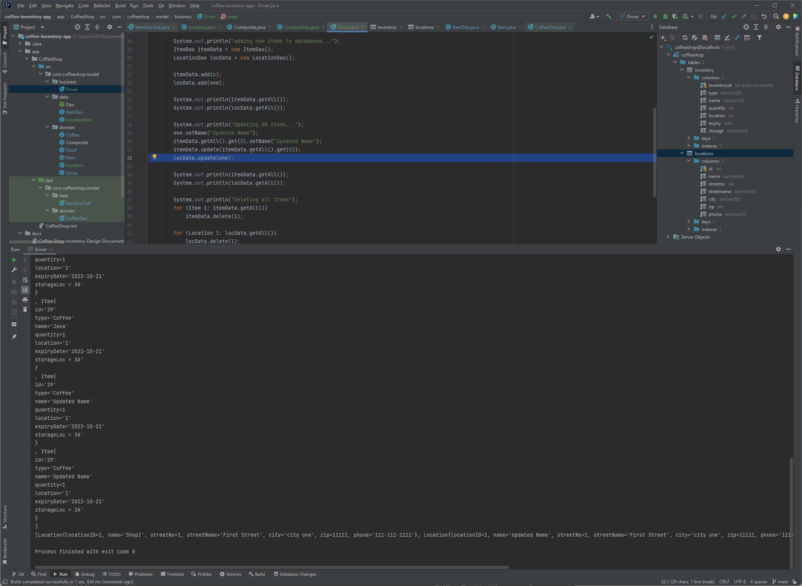
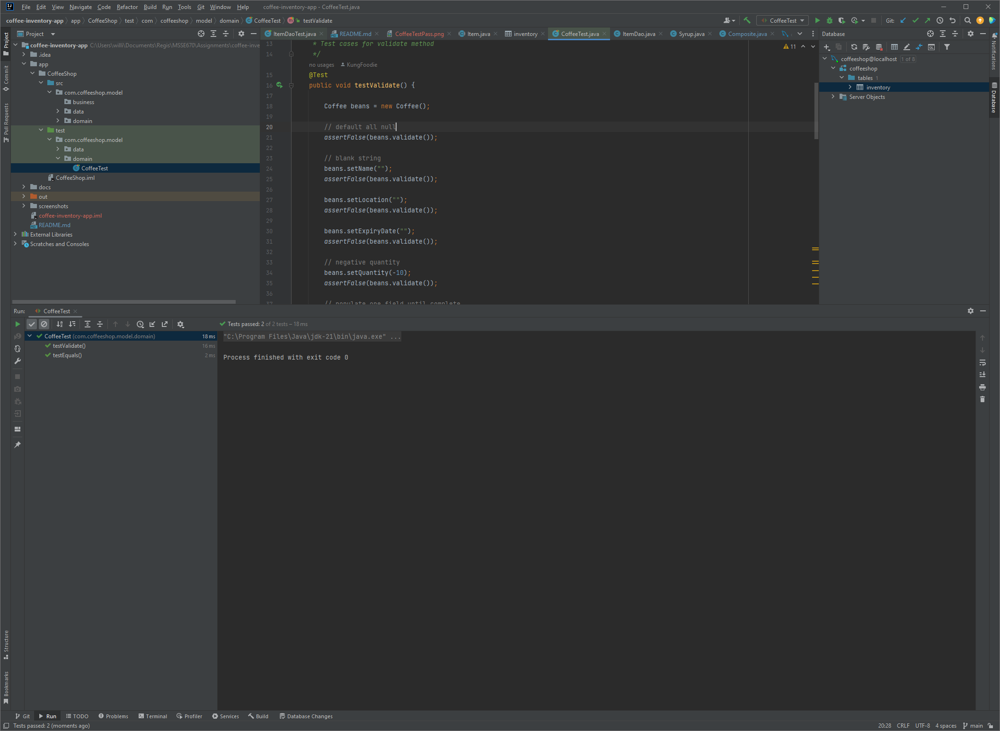
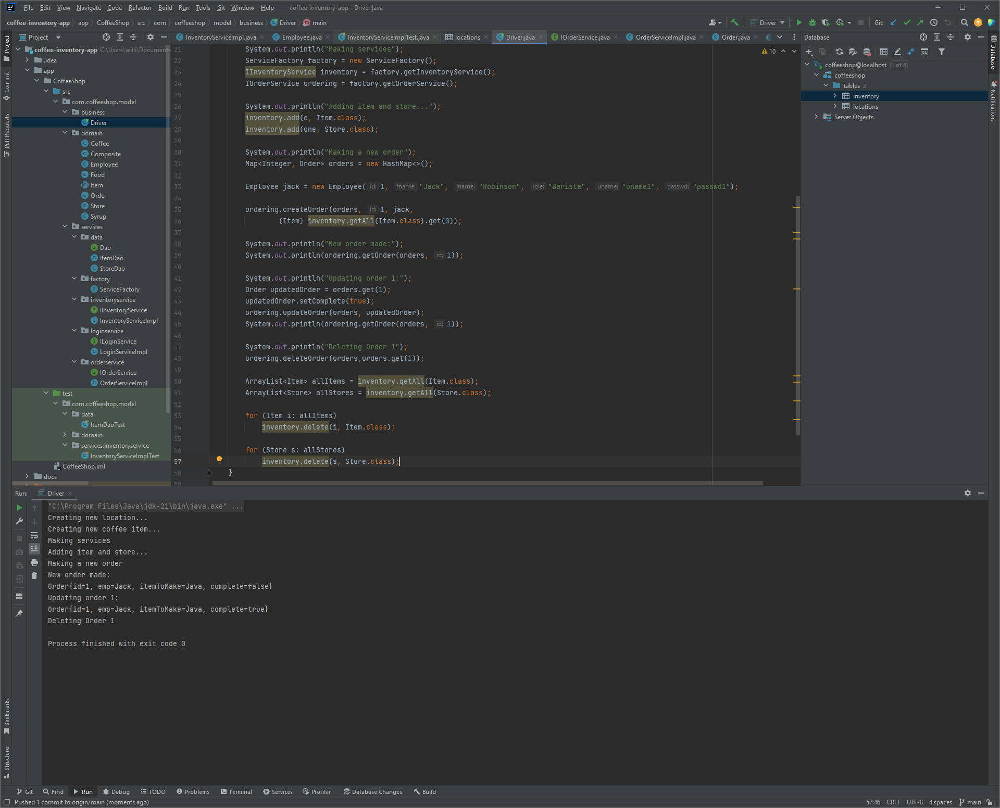
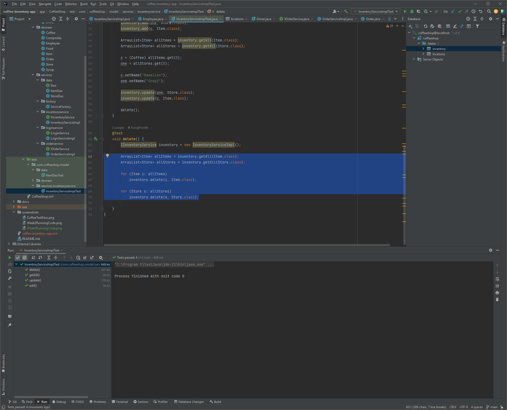
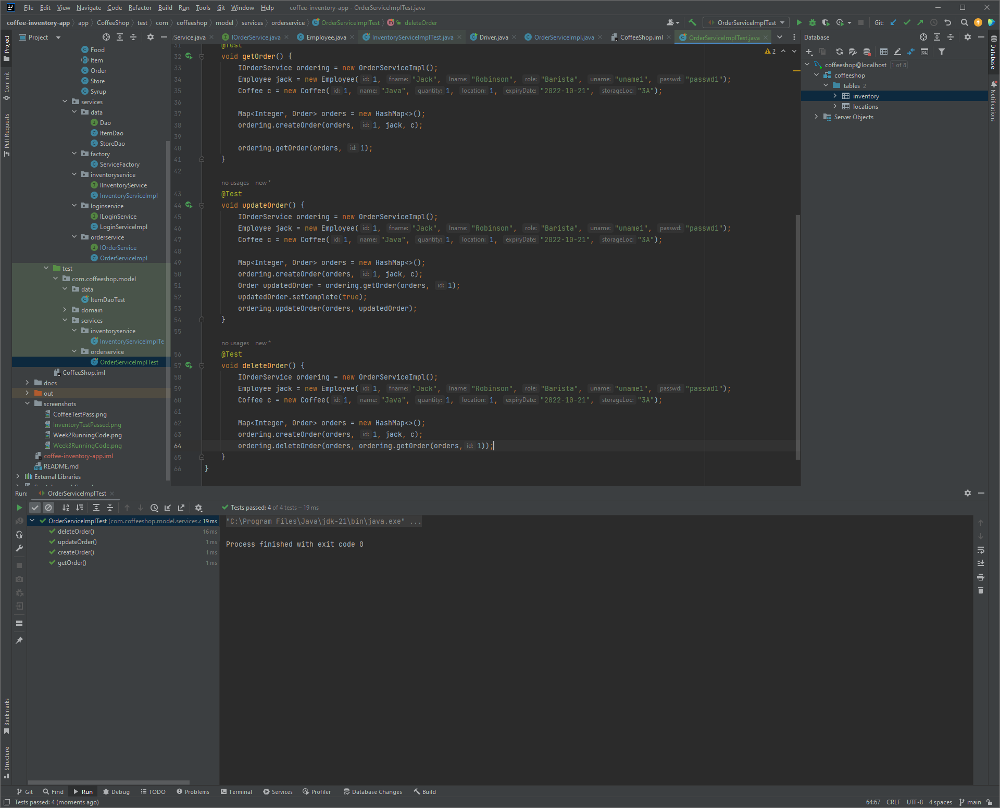
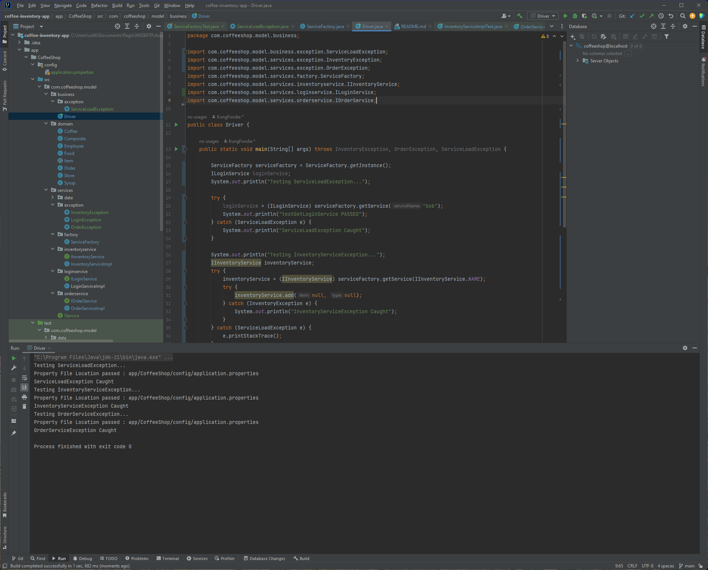
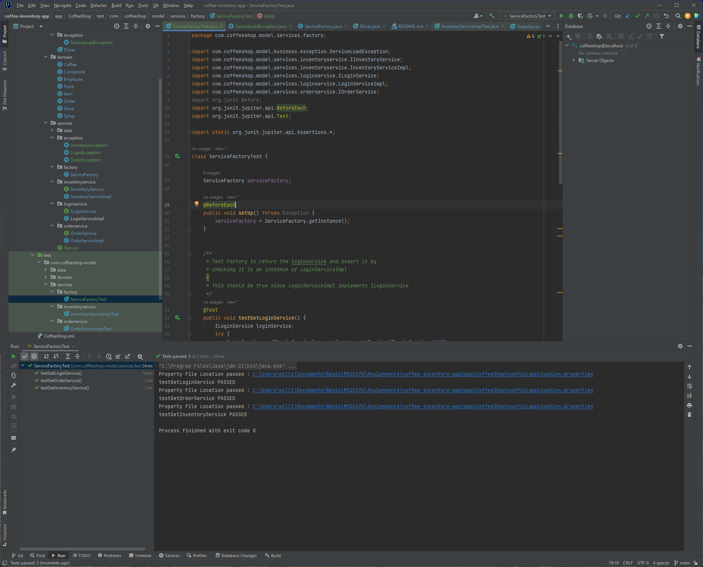

# coffee-inventory-app
## MSSE670 Project

### Intro
See Design Document located in docs folder for further information and updates as project progresses

### Defaults
```
DB User: coffeeshop@localhost\
DB Pass: coffeeshop123
```
### Week 2
Running Code

Domain Coffee Test



## Week 3
Running Code

Inventory Service Test
 
Ordering Service Test


## Week 4
Driver Code Testing all exceptions

Service Factory Test all get services
